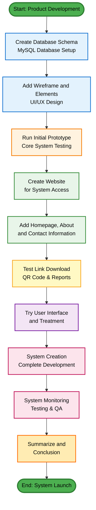
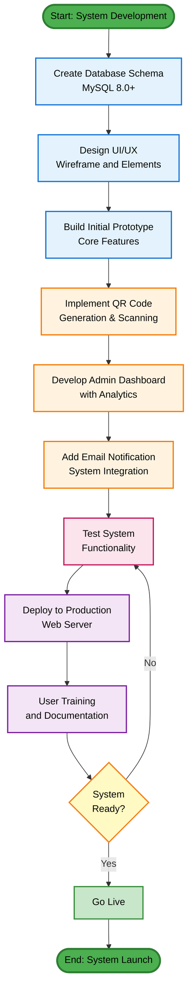
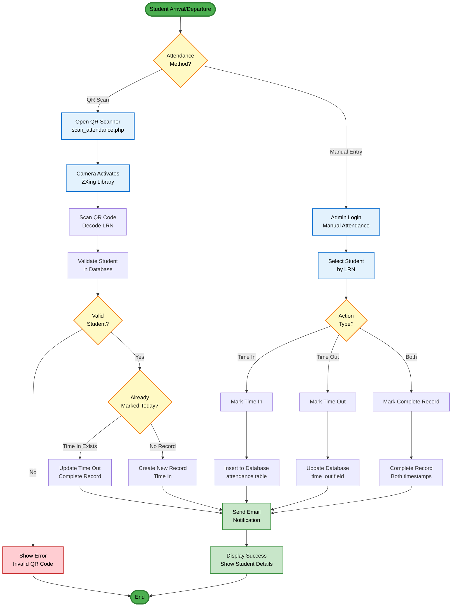
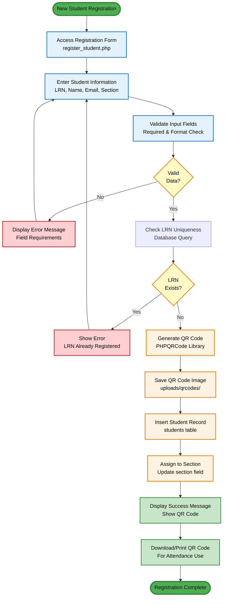
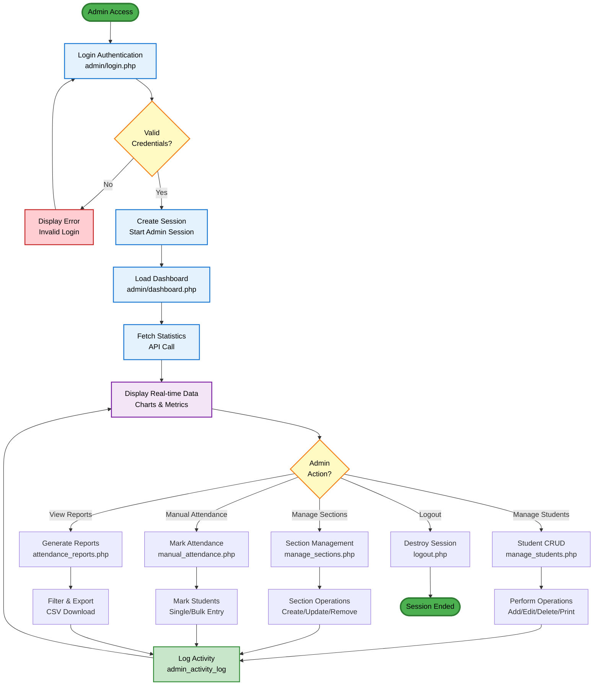
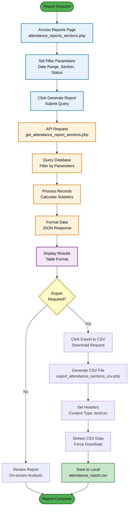
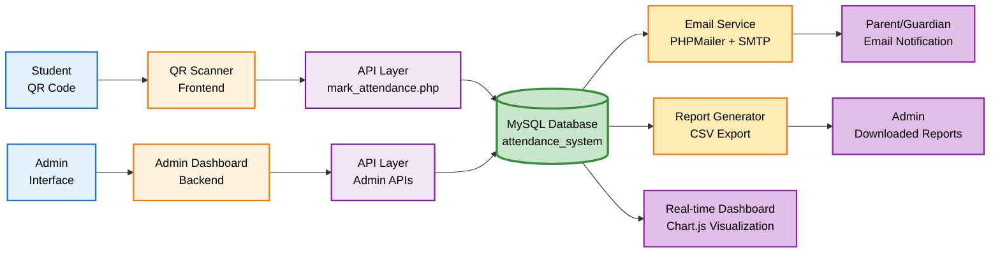
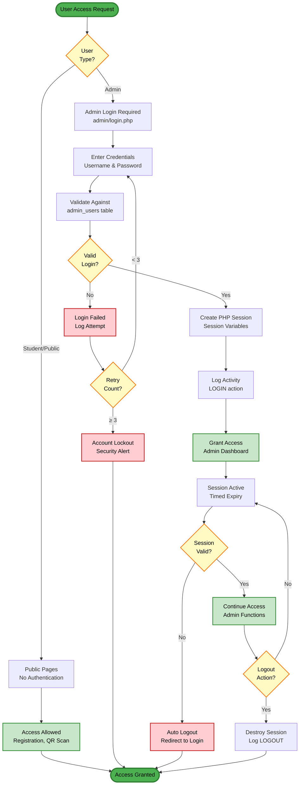

# GENERAL PROCEDURE FLOWCHART
## Academy of St. Joseph Claveria, Cagayan Inc.
### AttendEase - Attendance Management System

---

## I. GENERAL PROCEDURE - PRODUCT MAKING PROCEDURE
### AttendEase Attendance System Development



---

## II. SYSTEM DEVELOPMENT PROCEDURE



---

## III. ATTENDANCE MARKING PROCEDURE



---

## IV. STUDENT REGISTRATION PROCEDURE



---

## V. ADMIN DASHBOARD WORKFLOW



---

## VI. REPORT GENERATION PROCEDURE



---

## VII. DATA FLOW ARCHITECTURE



---

## VIII. SECURITY & AUTHENTICATION FLOW



---

## How to View These Flowcharts

### GitHub/GitLab
These Mermaid flowcharts will render automatically when viewing this file on GitHub or GitLab.

### VS Code
Install the **Mermaid Preview** extension:
1. Open VS Code Extensions (Ctrl+Shift+X)
2. Search for "Mermaid Preview"
3. Install and reload VS Code
4. Right-click this file → Preview Mermaid Diagrams

### Online Viewers
- [Mermaid Live Editor](https://mermaid.live/)
- [GitHub Markdown Preview](https://github.com)

### Export as Image
Use Mermaid CLI or online tools to export diagrams as PNG/SVG:
```bash
npm install -g @mermaid-js/mermaid-cli
mmdc -i GENERAL_PROCEDURE_FLOWCHART.md -o flowchart.png
```

---

## Legend

| Color | Meaning |
|-------|---------|
| 🟢 Green | Start/End Points, Success States |
| 🔵 Blue | Input/Data Entry Steps |
| 🟠 Orange | Processing/Computation |
| 🟣 Purple | Display/Output Operations |
| 🟡 Yellow | Decision Points/Conditionals |
| 🔴 Red | Error States/Warnings |

---

**Document Information:**
- **System**: AttendEase Attendance Management System
- **Institution**: Academy of St. Joseph Claveria, Cagayan Inc.
- **Version**: 1.0
- **Last Updated**: November 17, 2025
- **Technology**: PHP 8+, MySQL 8, JavaScript, Mermaid Flowcharts
